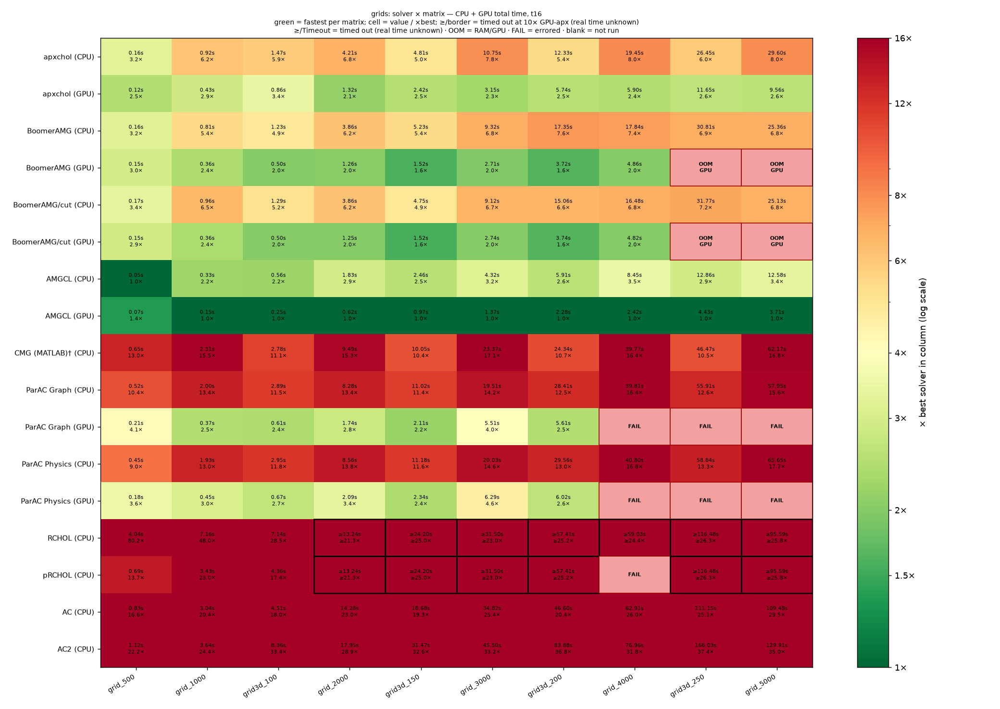
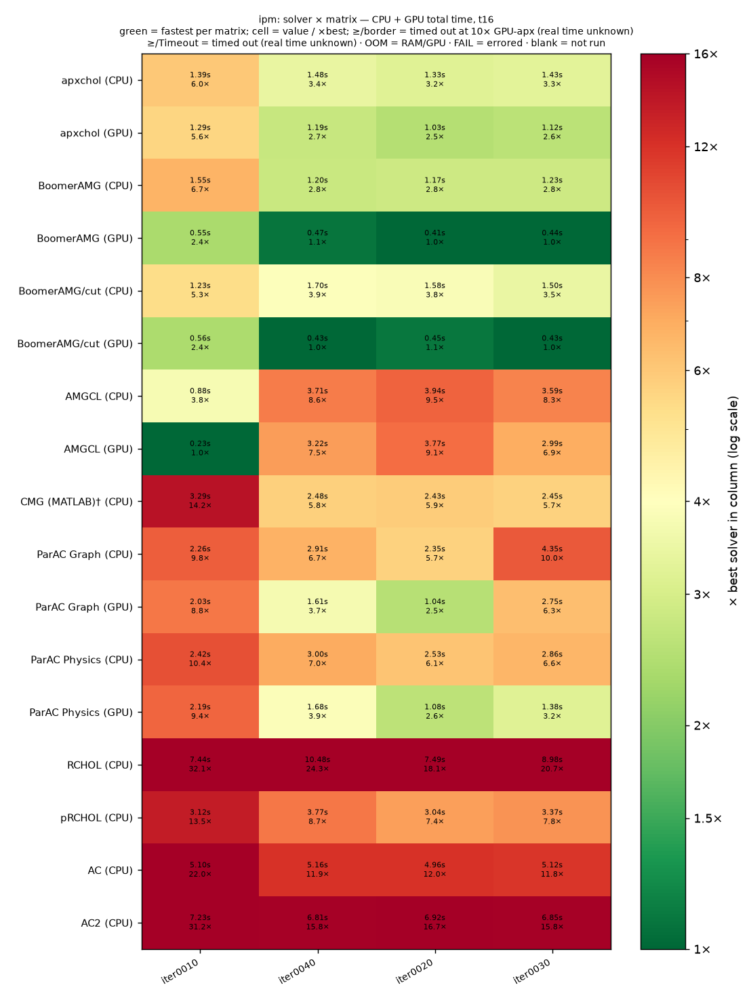
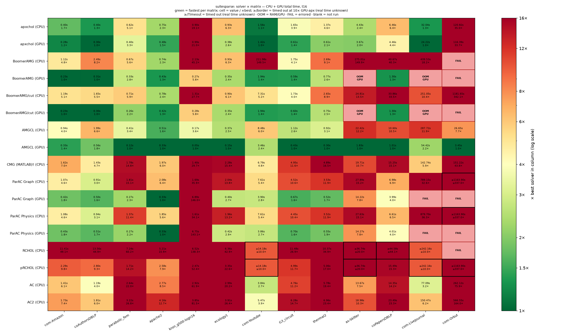
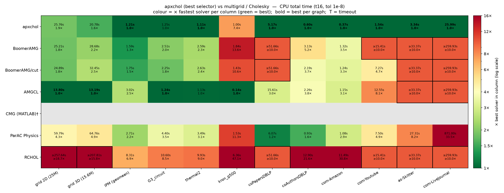
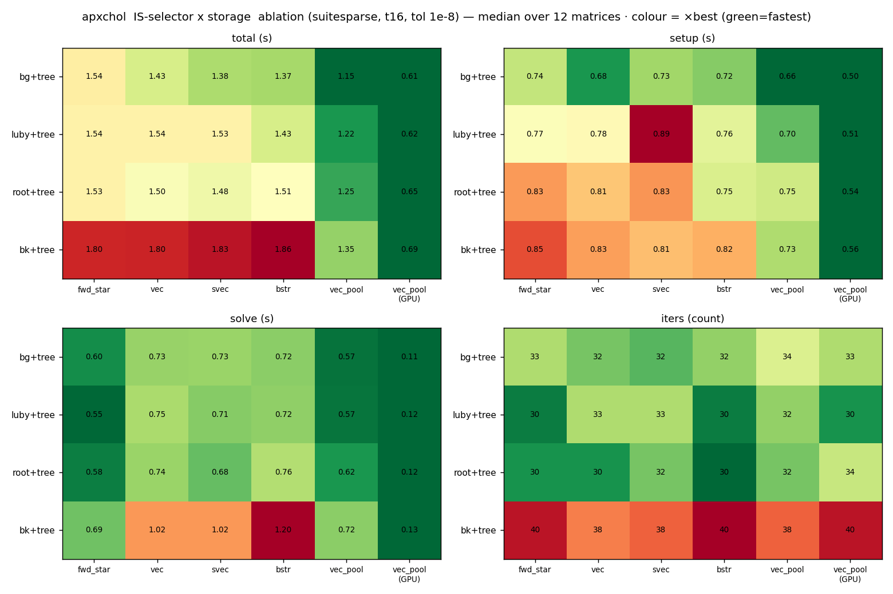

# apxchol benchmarks

This standalone CMake project compares `apxchol` with randomized-Cholesky and
multigrid solvers on generated grids, SuiteSparse matrices, and an LP-IPM
sequence.

- [Current laptop results](latest/) — CPU and RTX 4090 Laptop GPU
- [CSCS Daint results](daint/) — 72-core Grace CPU and GH200 GPU
- [Cell store](../results/cells/) — one JSON record per solver/configuration run

The headline rule is simple: every method receives the same operator and is
graded by the same independently recomputed true residual. Solver-specific
grounding, reordering, conversion, analysis, and transfers are charged to that
solver.

## Headline figures

These heatmaps show total time relative to the fastest completed method for each
matrix. CPU and GPU are separate rows; a timeout is a lower bound, not an
invented time.







Two focused views answer the main algorithmic questions without expanding the
landing page into the full chart catalog:

| cross-method comparison | apxchol selector/storage ablation |
|---|---|
|  |  |

Setup/solve splits, memory, iterations, accuracy, fill, scaling, and all family
variants remain in [latest/](latest/). Machine-specific 72-thread and scaling
figures are in [daint/](daint/).

## Compared solvers

| series | implementation used |
|---|---|
| `apxchol/bg` | this repository; block-greedy + tree sampling + pooled AoS adjacency |
| BoomerAMG | Hypre PCG with BoomerAMG, CPU and CUDA |
| AMGCL | smoothed-aggregation AMG with CG, CPU and CUDA |
| RCHOL / pRCHOL | upstream factorization; upstream MKL PCG on x86, explicitly labelled portable PCG on non-MKL systems |
| ParAC graph / physics | upstream CPU or CUDA drivers with the small audited patch stack under [patches/parac](patches/parac/) |
| AC / AC2 | Laplacians.jl reference implementation and its PCG |
| CMG | canonical MATLAB `cmg-solver`; iteration quality is comparable, MATLAB wall time is reported with a caveat |

`CG`, `LDLT`, CHOLMOD, alternative apxchol selectors, and storage backends are
available as diagnostics or ablations but are not folded into the declared
headline series.

### Native versus portable competitor paths

We call a competitor's own solve loop and setup API whenever it supplies one.
The result metadata records which path ran.

- RCHOL on x86 uses upstream `util/pcg.cpp` with MKL ILP64. Without MKL, the
  benchmark automatically uses the same upstream factor, permutation, recurrence,
  and stopping test with explicit portable CSR SpMV and triangular solves.
  `APXCHOL_RCHOL_PORTABLE_PCG=ON` forces this path even when MKL is present. It is
  labelled `rchol_pcg=portable-eigen`, never as an upstream-MKL timing.
- pRCHOL uses upstream reordering and factorization. If system METIS is absent,
  pinned official GKlib/METIS sources are built by the benchmark project.
- ParAC CPU still requires MKL. Its CUDA drivers do not; they build on Daint.
- AC/AC2 use the official Julia ARM64 build on Daint. CMG is not timed there:
  current native MATLAB for Linux is x86-64, and Octave timing is not a substitute
  for the MATLAB series.

## Protocol

### Operator and matrix class

Every matrix registry entry declares both what the file contains and what the
assembled operator is:

| field | values | effect |
|---|---|---|
| `kind` | `graph`, `operator` | a graph becomes `L = D - A`; an operator is used as stored |
| `class` | `laplacian`, `sddm` | a Laplacian has a component-wise constant null space; SDDM is full rank |

The benchmark binary requires these declarations for Matrix Market operators and
checks them structurally. It never guesses from the presence of numerical values:
a weighted adjacency matrix may also contain values.

Generated grids and social adjacency matrices are `graph/laplacian`. The IPM
sequence and most assembled SuiteSparse systems are `operator/sddm`; `ecology1`
is an `operator/laplacian`.

### Grounding and grading

Singular operators are solved on the original Laplacian. Each solver removes the
null space by its native compatible route:

- `apxchol` uses its rank-aware solve and component-wise centering;
- BoomerAMG and AMGCL receive one safe Dirichlet pin per component;
- ParAC graph mode receives a connected pure Laplacian and generates its native
  zero-sum RHS;
- external component-wise solvers are recombined before grading.

The stored grade is always

```text
||b - A x||_2 / ||b||_2
```

against the original assembled operator. A run is `complete` only at `<= 1e-8`;
otherwise it is `not_converged`. Recurrence residuals printed by a solver are
diagnostics, not the grade.

ParAC and AC require documented tolerance translations because their native
stopping tests use a different residual or basis. The formulas and the four
reviewable ParAC patches are documented in
[patches/parac/README.md](patches/parac/README.md). They never relax the common
true-residual threshold.

### Timing boundary

`setup_s` starts after common file parsing/operator assembly and includes all
solver-required work: grounding, format conversion, reordering, upload,
hierarchy/factor construction, and triangular-solve analysis. `solve_s` includes
per-RHS preparation, iteration, device transfers, and returning the solution in
the caller's ordering. Independent residual grading and cleanup are excluded.
The process-wide CUDA primary-context initialization is performed once before
any solver timer and reported separately as `cuda_init`; solver-specific module
loading, handles, allocations, preparation, and transfers remain charged where
they first occur. This models multiple distinct systems in one GPU process while
keeping an auditable cold-start cost outside the solver ranking.
Any `timeout_cap_s` bounds one complete logical cell, including calibration and
all requested repetitions; subprocesses do not each receive a fresh cap.

When an upstream library supplies the required operation, the harness uses it:
Hypre IJ assembly, AMGCL CRS adapters, RCHOL's reorder/PCG, and ParAC's
`write_graph.jl` producer. A harness implementation is used only for mandatory
work the competitor does not provide, and its provenance is recorded.

### Series and status rules

- One chart row is one `(solver, configuration, device)` tuple. No series is a
  per-matrix minimum over selectors, seeds, or toolchains.
- Headline apxchol is the declared `bg+tree[vec_pool_aos]` default. Selector and
  storage comparisons live in separate ablations.
- `complete`, `not_converged`, `timeout`, `failed`, `oom`, and `n/a` are distinct.
  A timeout is drawn as `>= timeout_cap_s`; an old timeout without a recorded cap
  remains unbounded.
- The main laptop campaign uses three repetitions and the median at 16 physical
  cores. Daint campaigns record their own thread count and resource allocation.
- The C++ driver may load LLVM `libomp` (apxchol) and GNU `libgomp` (system
  competitors) in one process. All benchmark runners therefore pin with an
  explicit rank-local `OMP_PLACES` list and `KMP_AFFINITY=norespect`; each cell
  records that contract. The binary refuses a bound multi-thread run that
  entered `main()` on fewer physical cores than `--threads`, instead of timing
  an apparent N-thread run on one core. Use `sweep_fair.py` for published timing.
- CPU RSS and GPU VRAM are separate metrics. Host RSS is never presented as a
  GPU solver's full footprint.

Run the mechanical series audit with:

```bash
PYTHONPATH=benchmarks python3 benchmarks/dev/audit_series_rule.py
```

## Workloads

- weighted 2D and 3D grid ladders;
- LP-IPM normal-equation operators `iter0010` through `iter0040`;
- SuiteSparse PDE/circuit/FEM matrices and social/scale-free graphs, including
  LiveJournal and Orkut.

`scripts/download_graphs.sh` fetches redistributed SuiteSparse inputs. The IPM
sequence is not redistributed; point `data/ipm/` at a Matrix Market sequence or
contact the authors.

## Build and run

The root and benchmark projects are separate builds.

```bash
cmake -S benchmarks -B benchmarks/build -DCMAKE_BUILD_TYPE=Release
cmake --build benchmarks/build -j"$(nproc)" --target benchmark

benchmarks/build/benchmark --graph grid --n 2000 \
  --solver apxchol_v1,hypre_boomeramg,amgcl \
  --threads 16 --tol 1e-8 --repeat 3 --csv
```

The direct command is convenient for functional checks. Timing campaigns must
go through the runners below so their OpenMP affinity and provenance are
controlled; bound legacy runs without the recorded affinity fields should not
be used for scaling claims.

Run the resume-safe CPU campaign and render its charts:

```bash
julia --project=benchmarks/julia -e 'using Pkg; Pkg.instantiate()'  # AC/AC2 + ParAC producer
python3 benchmarks/sweep_fair.py
PYTHONPATH=benchmarks python3 benchmarks/fair_charts.py --out benchmarks/latest
PYTHONPATH=benchmarks python3 benchmarks/combined_charts.py --out benchmarks/latest/figures
```

CUDA build and sweep:

```bash
cmake -S benchmarks -B benchmarks/build-cuda -DCMAKE_BUILD_TYPE=Release \
  -DAPXCHOL_USE_CUDA=ON \
  -DBENCH_HYPRE_USE_CUDA=ON \
  -DBUILD_GPU_RCHOL=ON
cmake --build benchmarks/build-cuda -j"$(nproc)" --target benchmark
python3 benchmarks/sweep_fair.py --device gpu
PYTHONPATH=benchmarks python3 benchmarks/gpu_charts.py --out benchmarks/latest/figures
PYTHONPATH=benchmarks python3 benchmarks/combined_charts.py --out benchmarks/latest/figures
```

Useful campaign controls are `--only`, `--threads`, `--repeat`, and `--store`.
Isolated build trees can be selected with `APXCHOL_BENCH_CPU_BIN` and
`APXCHOL_BENCH_GPU_BIN`; ParAC's GPU driver and cache have matching
`APXCHOL_PARAC_GPU_DRIVER`, `APXCHOL_PARAC_GPU_DRIVER_PHYS`, and
`APXCHOL_PARAC_SORTED_DIR` overrides.
`stale_cells.py` reports or removes only cells invalidated by a semantic change:

```bash
python3 benchmarks/stale_cells.py
python3 benchmarks/stale_cells.py --delete
```

The delete is recoverable from Git. Add a stale-cell rule whenever a change alters
the operator, RHS, timing boundary, convergence semantics, or solver result.

## Dependencies and local paths

Hypre, AMGCL, RCHOL, Eigen, and test/build helpers are fetched by CMake when not
provided. Optional integrations are enabled only when their dependencies exist:

| capability | dependency or option |
|---|---|
| pRCHOL | system METIS or pinned source fallback |
| upstream RCHOL PCG / ParAC CPU | Intel oneMKL |
| portable RCHOL PCG | `APXCHOL_RCHOL_PORTABLE_PCG=ON` |
| GPU methods | CUDA and `APXCHOL_USE_CUDA=ON` |
| Hypre GPU | `BENCH_HYPRE_USE_CUDA=ON` |
| ParAC GPU | `BUILD_GPU_RCHOL=ON` |
| AC/AC2 and ParAC preprocessing | Julia project under `benchmarks/julia` |
| CMG | MATLAB plus a `cmg-solver` checkout |

Out-of-tree paths may be provided through environment variables or the gitignored
`benchmarks/paths_local.py` / `benchmarks/paths_local.cmake`. The runner names the
missing variable when a requested external solver is unavailable. See
[runner_common.py](runner_common.py) and [parac_runner.py](parac_runner.py) for
the authoritative names.

## Result store and provenance

Each JSON cell records matrix, solver, configuration, device, thread count,
status, setup/solve/total time, iterations, true residual, memory, repetitions,
source commit, compiler/runtime metadata, and solver-specific provenance. The
renderers validate uniqueness and refuse ambiguous series.

Committed summaries and CSV exports are presentation artifacts. The cells are
the source of truth. Daint data stays under [daint/](daint/) and is not mixed
with laptop bars.

For detailed per-metric figures and tables, open [latest/README.md](latest/README.md)
or [latest/summary.md](latest/summary.md).
