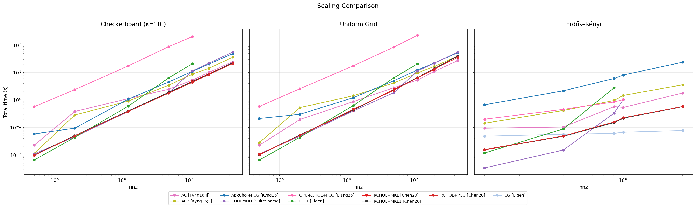
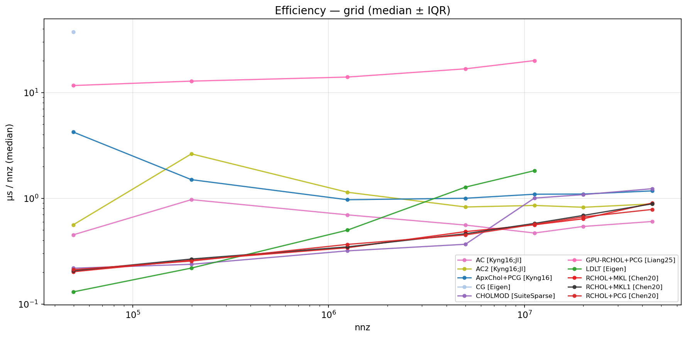
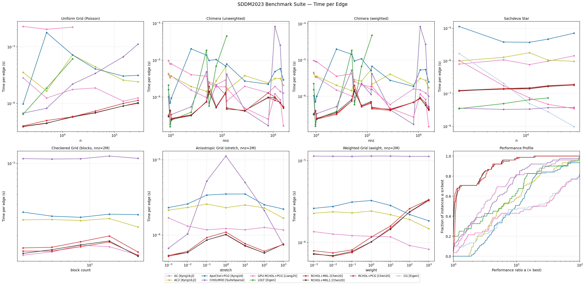
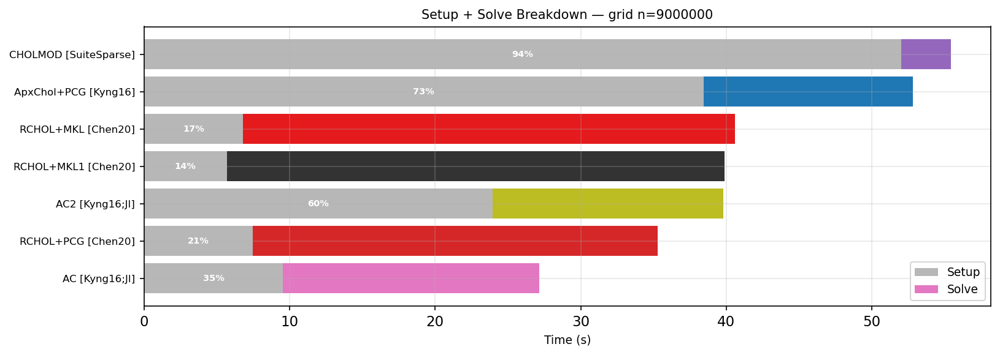
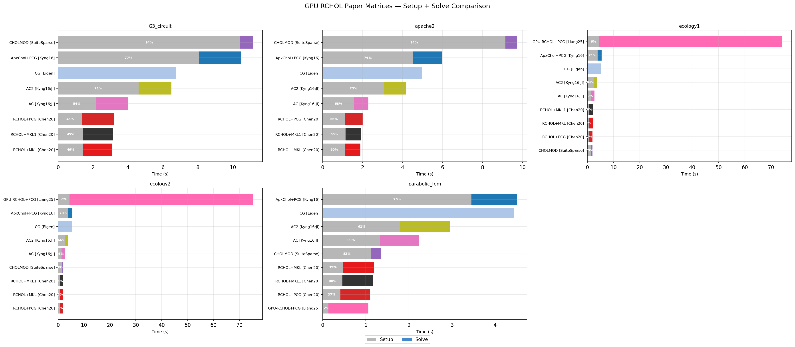
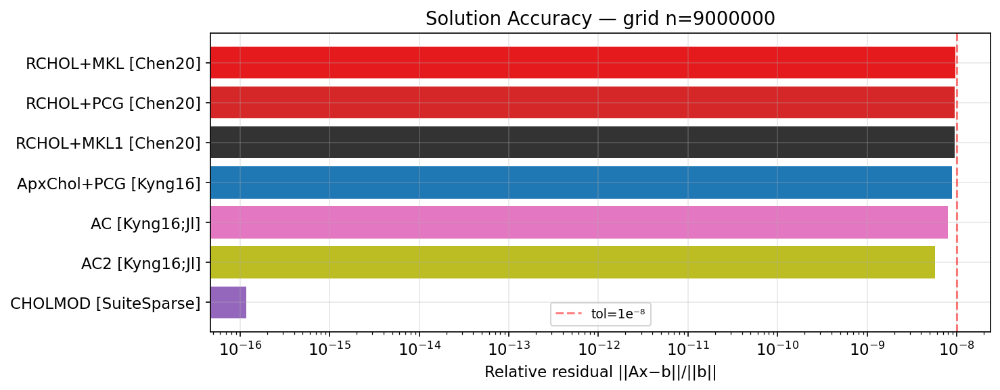

# Benchmarks

Comparative benchmarks for Laplacian/SDDM linear system solvers.

## Solvers

| Solver | Type | Implementation | Source |
|--------|------|----------------|--------|
| **ApxChol+PCG [Kyng16]** | Approximate Cholesky preconditioner + PCG | Ours (C++) | `benchmarks/src/` |
| **RCHOL+PCG [Chen20]** | Randomized Cholesky + PCG (Eigen) | [ut-padas/rchol](https://github.com/ut-padas/rchol) | FetchContent |
| **RCHOL+MKL [Chen20]** | Randomized Cholesky + PCG (MKL sparse BLAS) | [ut-padas/rchol](https://github.com/ut-padas/rchol) + MKL | FetchContent |
| **RCHOL+MKL1 [Chen20]** | RCHOL+MKL single-threaded | [ut-padas/rchol](https://github.com/ut-padas/rchol) + MKL | FetchContent |
| **CG [Eigen]** | Conjugate gradient (diagonal precond.) | Eigen | — |
| **LDLT [Eigen]** | Sparse direct LDL^T | Eigen | — |
| **CHOLMOD [SuiteSparse]** | Supernodal sparse Cholesky (direct) | [SuiteSparse](https://people.engr.tamu.edu/davis/suitesparse.html) | System library |
| **GPU-RCHOL+PCG [Liang25]** | GPU parallel RCHOL + PCG | [Tianyu-Liang/Parallel-Randomized-Cholesky](https://github.com/Tianyu-Liang/Parallel-Randomized-Cholesky) | FetchContent (CUDA) |
| **AC [Kyng16;Jl]** | ApproxChol (Julia reference) | [Laplacians.jl](https://github.com/danspielman/Laplacians.jl) | `benchmarks/julia/` |
| **AC2 [Kyng16;Jl]** | ApproxChol (Julia, augmented params) | [Laplacians.jl](https://github.com/danspielman/Laplacians.jl) | `benchmarks/julia/` |

*Excluded*: AMG+CG [AMGCL] (broken on Laplacians), CG+ICC [Eigen] (hits iteration cap),
pRCHOL+PCG (always worse than single-thread RCHOL).

## Benchmark Protocol

Following [SDDM2023](https://arxiv.org/abs/2303.00709):

- **Tolerance**: 1e-8 relative residual (‖Ax−b‖/‖b‖)
- **Repetitions**: 3 runs, median taken
- **Condition numbers**: κ = 10⁵ (for checkerboard)
- **Graph families**:
  - Grid Laplacians (uniform weights, up to 9M vertices)
  - Checkerboard grids (κ=10⁵, tile=4, up to 9M vertices)
  - Erdős-Rényi random graphs (up to ~1M edges)
  - SDDM2023 suite: uniform grid, chimera, weighted chimera, Sachdeva star,
    anisotropic grid, weighted grid, checkered grid (parameter sweeps at nnz≈2M)
  - GPU paper matrices from SuiteSparse (parabolic_fem, ecology1/2, apache2, G3_circuit)
  - Custom Matrix Market files
- **Metrics**: setup time, solve time, total time, PCG iterations, relative residual, fill-in ratio, µs/nnz
- **CSV schema**: `solver,graph,n,nnz,setup_s,solve_s,total_s,iters,rel_res,fillin,us_per_nnz`

## Running

```bash
# Build benchmarks (from repo root)
cd benchmarks && mkdir -p build && cd build
cmake .. -DCMAKE_BUILD_TYPE=Release
make -j$(nproc) benchmark

# Full benchmark suite
bash benchmarks/run.sh

# Quick smoke test (smaller sizes)
bash benchmarks/run.sh --quick

# Select specific bench sets
bash benchmarks/run.sh --quick --bench grid,checker

# Select specific solvers
bash benchmarks/run.sh --quick --solver rchol_mkl,apxchol

# Append to existing CSV
bash benchmarks/run.sh --bench erdos --append benchmarks/results/latest.csv

# Individual solver via the binary
benchmarks/build/benchmark --graph checkerboard --n 500 --kappa 100000 --solver apxchol --csv --repeat 3
```

**Bench sets**: `grid`, `checker`, `erdos`, `tile`, `mtx`, `gpu_paper`, `sddm2023`
**Solvers**: `apxchol`, `cg`, `ldlt`, `rchol`, `rchol_mkl`, `rchol_mkl1`, `cholmod`, `amgcl`, `ac`, `ac2`, `gpu_rchol`

## Results

Results are saved to `benchmarks/results/` as timestamped CSV files (gitignored).
`benchmarks/results/latest.csv` always points to the most recent run.

The `benchmarks/latest/` directory contains the most recent results and
PNG plots, **committed to the repo** so charts are visible on GitHub.

### Key Charts

#### Scaling Comparison (Checker / Grid / Erdős-Rényi)



#### Efficiency (µs/nnz on grids)



#### SDDM2023 Dashboard



#### Setup + Solve Breakdown



#### GPU Paper Matrices



#### Solution Accuracy



### All Generated Charts

**Comparison** (`latest/comparison/`):
- `bar_comparison.png` — Setup/solve time breakdown at largest grid size
- `efficiency.png` — µs per nonzero scaling (median ± IQR)
- `residual.png` — Solution accuracy with tol=1e-8 reference line

**SDDM2023** (`latest/sddm/`):
- `sddm_uniform_grid.png`, `sddm_chimera.png`, `sddm_wchimera.png`, `sddm_star.png` — Family scaling
- `sddm_aniso_params.png`, `sddm_wgrid_params.png`, `sddm_checkered_params.png` — Parameter sweeps (nnz≈2M)
- `sddm_overview.png` — Performance profile across all SDDM instances
- `sddm_bar_*.png` — Per-family setup/solve bar charts

**GPU** (`latest/gpu/`):
- `combined_gpu_paper.png` — All 5 SuiteSparse matrices side-by-side
- `gpu_bar_*.png` — Per-matrix bar charts

**Combined dashboards** (`latest/combined/`):
- `combined_scaling.png` — Checker + Grid + Erdős-Rényi (1×3 panel)
- `sddm_combined.png` — Full SDDM2023 dashboard (2×4 panel)
- `combined_sddm_bar.png` — All SDDM families bar comparison

```bash
# Regenerate plots manually
python3 benchmarks/plot.py benchmarks/results/latest.csv
```

## Notes

### Solver Characteristics

- **RCHOL+MKL**: Best µs/nnz across most graph families. Approximate solver
  (rel_res ≈ 2e-5) — the preconditioner quality limits residual, not convergence.
  Scales near-linearly.
- **CHOLMOD**: Machine-precision accuracy (rel_res ≈ 1e-16). Fastest at
  moderate sizes but superlinear scaling — memory-bound at n > 1M.
- **ApxChol+PCG**: Our implementation. Competitive scaling, more iterations
  than RCHOL due to simpler greedy IS elimination (vs degree-ordered).
- **AC2 [Julia]**: Laplacians.jl reference. Includes JIT warmup overhead.
- **CG [Eigen]**: Unpreconditioned — iteration count grows as O(√κ·√n).
  Competitive on well-conditioned small graphs, diverges on ill-conditioned ones.
- **GPU-RCHOL**: Benefits from massive parallelism on large sparse problems
  (parabolic_fem: 1.06s). Slower on grid-structured graphs due to deep
  elimination trees killing GPU parallelism.

### GPU Implementation

GPU-accelerated parallel RCHOL from Liang et al. (2025),
"Parallel GPU-Accelerated Randomized Construction of Approximate Cholesky
Preconditioners" ([arXiv:2505.02977](https://arxiv.org/abs/2505.02977)).

- **Code**: https://github.com/Tianyu-Liang/Parallel-Randomized-Cholesky
- **Requirements**: CUDA 12.4+
- **Known issues**: Crashes on apache2 (linear elimination tree) and
  G3_circuit (elimination tree depth 1.46M). Works well on parabolic_fem
  and ecology matrices.

<!-- BENCHMARK_RESULTS_START -->
*Last updated: 2026-03-12 21:45:57*


<!-- BENCHMARK_RESULTS_END -->
