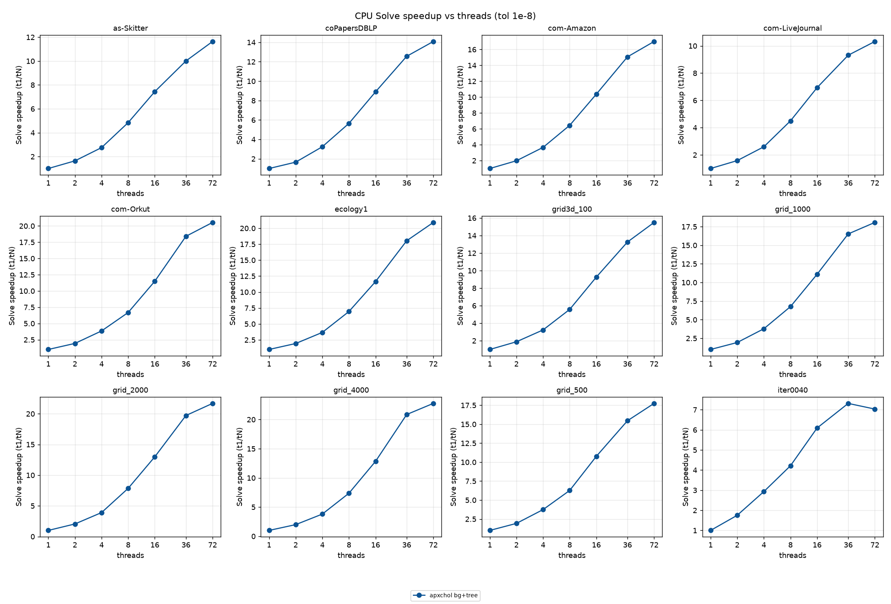

# Daint benchmark snapshot — primary performance source

Daint is the primary performance source; the [laptop snapshot](../latest/) is historical.

This snapshot selects T=72 before comparing outcomes. It contains 459 cells over 27/27 registered matrices. 27 of 486 declared headline cells are missing. T is the requested headline thread budget; the CSV records effective thread counts separately for serial and thread-limited solvers.

Every completed retained solve must meet the original-operator true-relative-residual target of `1e-8`. CUDA initialization is reported separately. Setup includes mandatory solver preparation; the solve column includes the remaining complete solver call. The CSV preserves configured warmup counts and observed retained counts. Timeout scope and the raw deadline are separate from any valid per-solve lower bound.

[Values and outcomes](results.csv) · [Coverage and missing cells](coverage.json) · [Common protocol](../README.md) · [Selected-source provenance](selection_provenance.json) · [Historical Daint campaigns](HISTORICAL.md)

| View | Figures |
|---|---|
| Total time | [overview_grids](figures/combined_overview_grids.png), [overview_ipm](figures/combined_overview_ipm.png), [overview_suitesparse](figures/combined_overview_suitesparse.png) |
| CPU totals | [overview_cpu_grids](figures/combined_overview_cpu_grids.png), [overview_cpu_ipm](figures/combined_overview_cpu_ipm.png), [overview_cpu_suitesparse](figures/combined_overview_cpu_suitesparse.png) |
| GPU totals | [overview_gpu_grids](figures/combined_overview_gpu_grids.png), [overview_gpu_ipm](figures/combined_overview_gpu_ipm.png), [overview_gpu_suitesparse](figures/combined_overview_gpu_suitesparse.png) |
| CPU setup and solve | [breakdown_cpu_grids_2d](figures/combined_breakdown_cpu_grids_2d.png), [breakdown_cpu_grids_3d](figures/combined_breakdown_cpu_grids_3d.png), [breakdown_cpu_ipm](figures/combined_breakdown_cpu_ipm.png), [breakdown_cpu_suitesparse_giants](figures/combined_breakdown_cpu_suitesparse_giants.png), [breakdown_cpu_suitesparse_giants_xl](figures/combined_breakdown_cpu_suitesparse_giants_xl.png), [breakdown_cpu_suitesparse_small](figures/combined_breakdown_cpu_suitesparse_small.png) |
| GPU setup and solve | [breakdown_gpu_grids_2d](figures/combined_breakdown_gpu_grids_2d.png), [breakdown_gpu_grids_3d](figures/combined_breakdown_gpu_grids_3d.png), [breakdown_gpu_ipm](figures/combined_breakdown_gpu_ipm.png), [breakdown_gpu_suitesparse_giants](figures/combined_breakdown_gpu_suitesparse_giants.png), [breakdown_gpu_suitesparse_giants_xl](figures/combined_breakdown_gpu_suitesparse_giants_xl.png), [breakdown_gpu_suitesparse_small](figures/combined_breakdown_gpu_suitesparse_small.png) |
| Setup scaling | [threads_gpu_setup_speedup](figures/threads_gpu_setup_speedup.png), [threads_setup_speedup](figures/threads_setup_speedup.png) |
| Converged-solve scaling | [threads_gpu_solve_speedup](figures/threads_gpu_solve_speedup.png), [threads_solve_speedup](figures/threads_solve_speedup.png) |

Heatmap colours normalize within each matrix column; they do not compare absolute speed between machines. Timeout, numerical non-convergence, execution failure, unsupported input, and missing measurement remain distinct.

The 2D grids have a coefficient jump from 1 to 0.01. The 3D grids have unit weights. Native CMG is labelled as a serial packed implementation; canonical MATLAB CMG and serial Julia reference solvers retain their own labels and timing boundaries.

Status counts: complete: 423, failed: 17, n/a: 6, not_converged: 7, timeout: 6.

[Platform-specific availability and exceptions](PLATFORM.md)

## Grid total times

## IPM total times

## SuiteSparse total times

## CPU setup scaling

## CPU converged-solve scaling

## GPU setup scaling

## GPU converged-solve scaling

## Snapshot provenance

This refresh selects 459/486 headline identities from the audited 2026-09-07
selection: 423 complete, 17 failed, 7 nonconverged, 6 timeout and 6 recorded n/a.
All 108 ParAC Graph/Physics CPU/GPU identities are represented (103 complete,
5 failed). The 27 remaining numerical gaps are canonical MATLAB CMG platform
exceptions; packed native CMG has its own 27 recorded cells. Corrected Eigen
ordering replaces four RCHOL results, preserving the as-Skitter nonconvergence.

Cell hashes and source/binary revisions are recorded in selection_provenance.json;
the CSV preserves measurement values without mixing in pending optimization
experiments. Scaling contains 84 CPU and 84 GPU converged records. The recorded
thread count denotes host threads; GPU-solve scaling also reflects the factors
produced by those host-thread configurations, not GPU thread-count scaling.

Regenerate from the matching selected raw-cell stores with
`python3 benchmarks/render_snapshot.py --cells CELLS --out OUTPUT --threads 72
--platform Daint --scaling-store SCALING --scaling-matrices MATRICES
--scaling-threads 1,2,4,8,16,36,72`. The committed CSVs are presentation extracts;
archived historical renderers remain linked separately.
