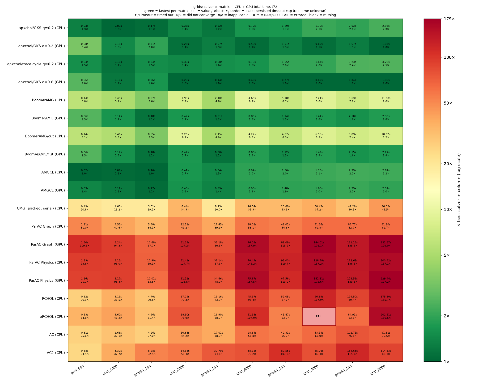
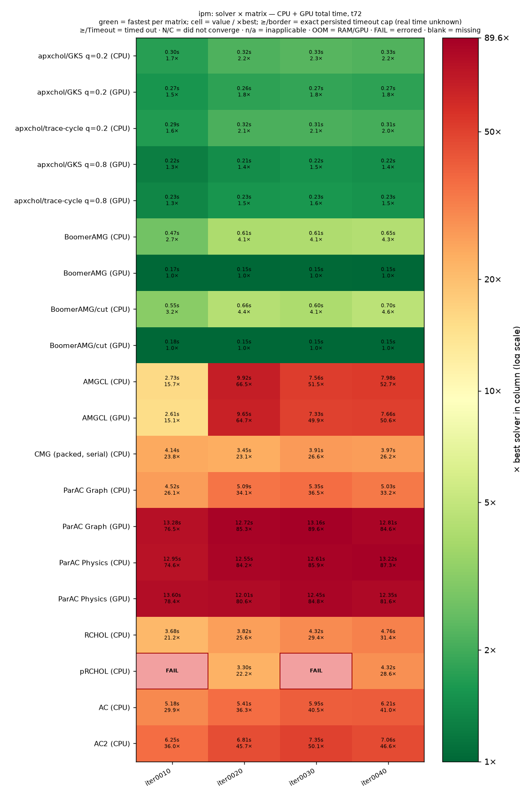
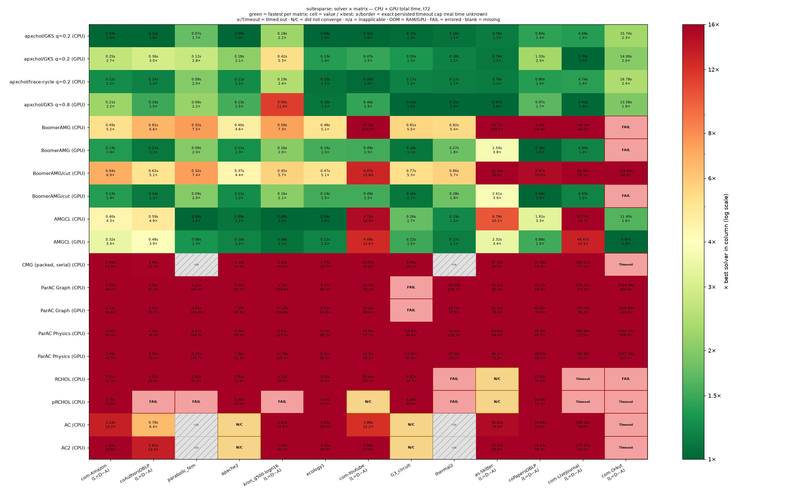
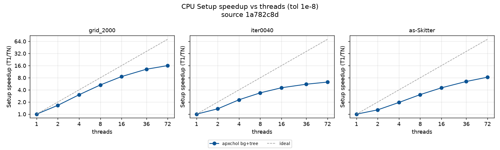
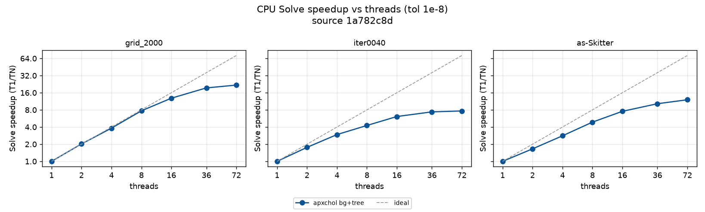
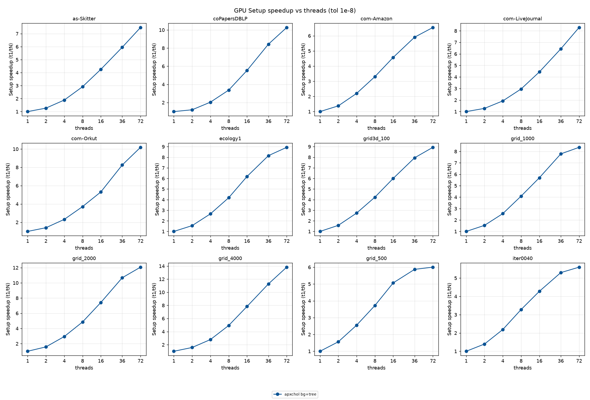
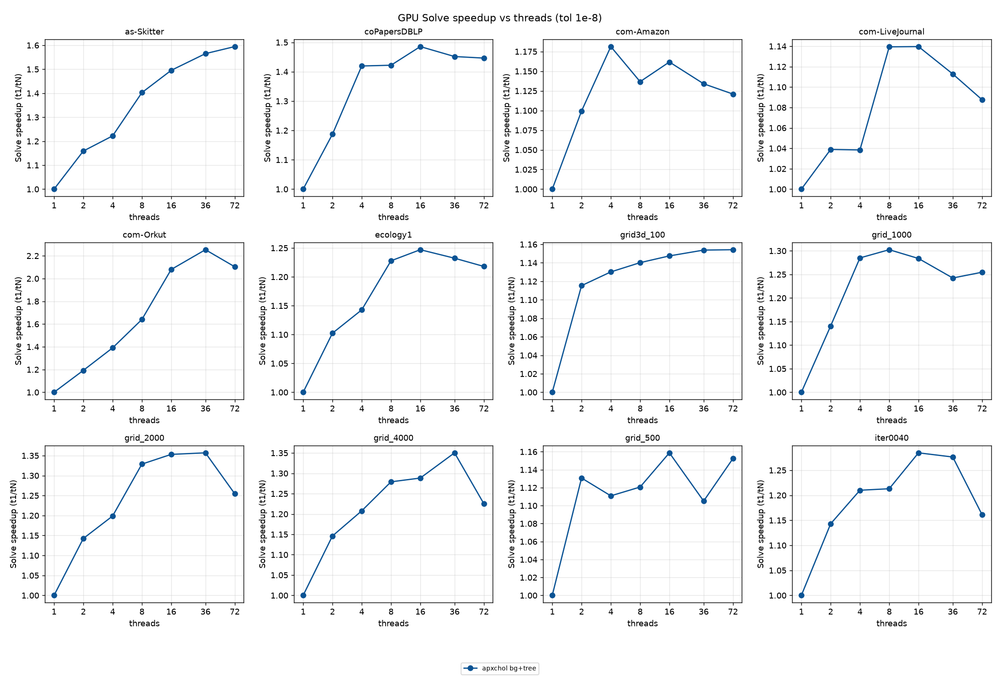
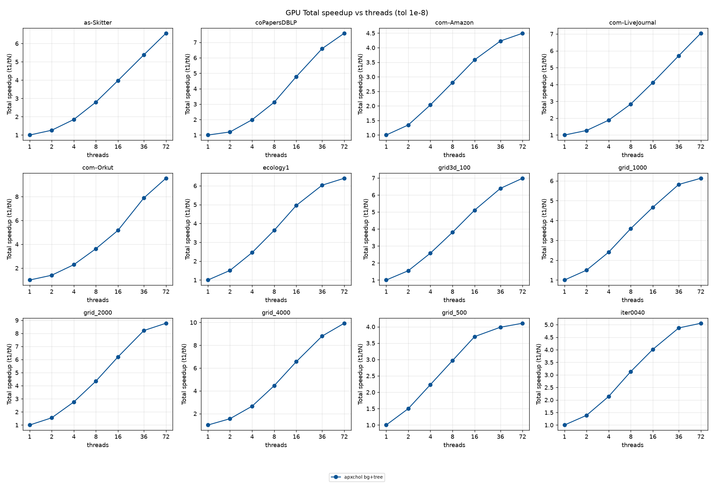

# Daint benchmark snapshot — primary performance source

Daint is the primary performance source; the [laptop snapshot](../archive/laptop-20260908/) is historical.

CPU thread scaling was refreshed on source `1a782c8d` (job 4619429): all 84 points and 17 controls completed converged solves. The T=72 headline tables retain their existing selected cells; the GPU scaling figures remain historical source `ea01e2ff`.

This snapshot selects T=72 before comparing outcomes. It contains 459 cells over 27/27 registered matrices. 27 of 486 declared headline cells are missing. T is the requested headline thread budget; the CSV records effective thread counts separately for serial and thread-limited solvers.

Every completed retained solve must meet the original-operator true-relative-residual target of `1e-8`. CUDA initialization is reported separately. Setup includes mandatory solver preparation; the solve column includes the remaining complete solver call. The CSV preserves configured warmup counts and observed retained counts. Timeout scope and the raw deadline are separate from any valid per-solve lower bound.

[Values and outcomes](results.csv) · [Coverage and missing cells](coverage.json) · [Common protocol](../README.md) · [Selected-source provenance](selection_provenance.json) · [Historical Daint campaigns](HISTORICAL.md)

| View | Figures |
|---|---|
| Total time | [overview_grids](figures/combined_overview_grids.png), [overview_ipm](figures/combined_overview_ipm.png), [overview_suitesparse](figures/combined_overview_suitesparse.png) |
| CPU totals | [overview_cpu_grids](figures/combined_overview_cpu_grids.png), [overview_cpu_ipm](figures/combined_overview_cpu_ipm.png), [overview_cpu_suitesparse](figures/combined_overview_cpu_suitesparse.png) |
| GPU totals | [overview_gpu_grids](figures/combined_overview_gpu_grids.png), [overview_gpu_ipm](figures/combined_overview_gpu_ipm.png), [overview_gpu_suitesparse](figures/combined_overview_gpu_suitesparse.png) |
| CPU setup and solve | [breakdown_cpu_grids_2d](figures/combined_breakdown_cpu_grids_2d.png), [breakdown_cpu_grids_3d](figures/combined_breakdown_cpu_grids_3d.png), [breakdown_cpu_ipm](figures/combined_breakdown_cpu_ipm.png), [breakdown_cpu_suitesparse_giants](figures/combined_breakdown_cpu_suitesparse_giants.png), [breakdown_cpu_suitesparse_giants_xl](figures/combined_breakdown_cpu_suitesparse_giants_xl.png), [breakdown_cpu_suitesparse_small](figures/combined_breakdown_cpu_suitesparse_small.png) |
| GPU setup and solve | [breakdown_gpu_grids_2d](figures/combined_breakdown_gpu_grids_2d.png), [breakdown_gpu_grids_3d](figures/combined_breakdown_gpu_grids_3d.png), [breakdown_gpu_ipm](figures/combined_breakdown_gpu_ipm.png), [breakdown_gpu_suitesparse_giants](figures/combined_breakdown_gpu_suitesparse_giants.png), [breakdown_gpu_suitesparse_giants_xl](figures/combined_breakdown_gpu_suitesparse_giants_xl.png), [breakdown_gpu_suitesparse_small](figures/combined_breakdown_gpu_suitesparse_small.png) |
| Setup scaling | [threads_gpu_setup_speedup](figures/threads_gpu_setup_speedup.png), [threads_setup_speedup](figures/threads_setup_speedup.png) |
| Converged-solve scaling | [threads_gpu_solve_speedup](figures/threads_gpu_solve_speedup.png), [threads_solve_speedup](figures/threads_solve_speedup.png) |
| Total scaling | [threads_gpu_total_speedup](figures/threads_gpu_total_speedup.png), [threads_total_speedup](figures/threads_total_speedup.png) |

Heatmap colours normalize within each matrix column; they do not compare absolute speed between machines. Timeout, numerical non-convergence, execution failure, unsupported input, and missing measurement remain distinct.

The 2D grids have a coefficient jump from 1 to 0.01. The 3D grids have unit weights. Native CMG is labelled as a serial packed implementation; canonical MATLAB CMG and serial Julia reference solvers retain their own labels and timing boundaries.

Status counts: complete: 426, failed: 14, n/a: 6, not_converged: 7, timeout: 6.

[Platform-specific availability and exceptions](PLATFORM.md)

## Grid total times

## IPM total times

## SuiteSparse total times

## CPU setup scaling

Source: `1a782c8d`, CPU campaign 4619429.

[84 measured cells](thread_scaling.csv) · [Baseline and iteration diagnostics](cpu_scaling_diagnostics.csv) · [Campaign provenance and controls](cpu_scaling_provenance.json)

The 12 matrices cover T=1,2,4,8,16,36,72, one warmup and three retained repetitions per point. Each phase comes from the same retained repeat selected by median total time. Orkut ran across nodes: its six multi-thread points use each node’s measured T=1 control, giving **10.68× setup** at T=72. Other matrices use their main T=1 cell. The explicit reference times are exported in the CSV.

The main view uses three representative matrices: a four-million-row grid,
LP-IPM `iter0040`, and the 1.70-million-row SuiteSparse `as-Skitter` graph.
These plots currently contain the audited apxchol series only. Matched
AMGCL, default Hypre, and ParAC Graph thread sweeps are pending; the T=72
headline cells are not substituted for missing scaling curves.

Both axes are logarithmic. Equal spacing shows equal multiplicative changes;
the dashed speedup line is ideal linear scaling. The shared seconds scale
compares absolute costs across panels, while speedup compares each solver with
its own T=1 reference. Log axes make wide timing ranges readable but compress
absolute differences, so the [21-row extract](thread_scaling_cpu_representative.csv)
retains the exact times.

[Representative CPU setup times](figures/threads_cpu_representative_setup_seconds.png)

[Full 12-matrix setup scaling](figures/threads_setup_speedup.png)

## CPU converged-solve scaling

Source: `1a782c8d`, CPU campaign 4619429.

These are full solves at true relative residual ≤1e-8. Thread count changes the preconditioner and iteration count: Orkut’s same-node speedup is **21.15×**, with iterations changing 50→18. The diagnostics separate average time per iteration from full solve speedup. Factor fill was not measured and remains blank.

[Representative CPU converged-solve times](figures/threads_cpu_representative_solve_seconds.png)

[Full 12-matrix converged-solve scaling](figures/threads_solve_speedup.png)

Current apxchol absolute times at T=72 (seconds):

| Matrix | Setup | Converged solve | Total |
|---|---:|---:|---:|
| grid_2000 | 0.1445 | 0.1824 | 0.3269 |
| iter0040 | 0.2114 | 0.1202 | 0.3316 |
| as-Skitter | 0.5144 | 0.2467 | 0.7610 |

## CPU total scaling

Source: `1a782c8d`, CPU campaign 4619429.

[Full 12-matrix total scaling](figures/threads_total_speedup.png)

Full comparison with the historical CPU snapshot

## Comparison with the historical CPU snapshot

The [previous 84 CPU cells and figures](historical/cpu-scaling-ea01/) are preserved on source `ea01e2ff`. The table compares the displayed T=72 speedups; [all 84 absolute-time comparisons](cpu_scaling_vs_ea01.csv) are available. These are separate campaigns, not an interleaved old/new-binary test. Historical curves retain their original main-T1 reference; current Orkut points use same-node controls.

| Matrix | Historical setup speedup | Current setup speedup | Historical solve speedup | Current solve speedup |
|---|---:|---:|---:|---:|
| as-Skitter | 7.97× | 8.26× | 11.64× | 12.05× |
| coPapersDBLP | 9.83× | 10.24× | 14.08× | 14.27× |
| com-Amazon | 6.65× | 6.60× | 17.01× | 17.38× |
| com-LiveJournal | 7.62× | 8.88× | 10.32× | 11.55× |
| com-Orkut | 9.63× | 10.68× | 20.54× | 21.15× |
| ecology1 | 10.86× | 10.87× | 20.91× | 20.95× |
| grid3d_100 | 9.32× | 9.45× | 15.49× | 15.11× |
| grid_1000 | 10.91× | 11.28× | 18.06× | 20.51× |
| grid_2000 | 15.72× | 16.01× | 21.69× | 21.79× |
| grid_4000 | 13.25× | 15.35× | 22.76× | 22.90× |
| grid_500 | 6.49× | 6.61× | 17.74× | 18.30× |
| iter0040 | 5.89× | 6.25× | 7.03× | 7.66× |

Historical GPU scaling: all 12 matrices

## GPU setup scaling

Historical source: `ea01e2ff`; these figures were not rerun by the CPU campaign.

## GPU converged-solve scaling

Historical source: `ea01e2ff`; these figures were not rerun by the CPU campaign.

## GPU total scaling

Historical source: `ea01e2ff`.

## Snapshot provenance

This refresh selects 459/486 headline identities from the audited 2026-09-07
selection: 426 complete, 14 failed, 7 nonconverged, 6 timeout and 6 recorded n/a.
All 108 ParAC Graph/Physics CPU/GPU identities are represented (106 complete,
2 failed). The 27 remaining numerical gaps are canonical MATLAB CMG platform
exceptions; packed native CMG has its own 27 recorded cells. Corrected Eigen
ordering replaces four RCHOL results, preserving the as-Skitter nonconvergence.

Cell hashes and source/binary revisions are recorded in selection_provenance.json;
the CSV preserves measurement values without mixing in pending optimization
experiments. CPU scaling now contains 84 source-1a records from job 4619429;
the 84 source-ea01 GPU scaling records are unchanged. This refresh does not
replace any headline solver cell or reinterpret an older failure. The recorded
thread count denotes host threads; GPU-solve scaling also reflects the factors
produced by those host-thread configurations, not GPU thread-count scaling.

Regenerate from the matching selected raw-cell stores with
`python3 benchmarks/render_snapshot.py --cells CELLS --out OUTPUT --threads 72
--platform Daint --scaling-store SCALING --scaling-matrices MATRICES
--scaling-threads 1,2,4,8,16,36,72`. The committed CSVs are presentation extracts;
archived historical renderers remain linked separately. For CPU job 4619429,
the six Orkut rendering records carry `provenance.scaling_baseline` copied from
the audited same-node T=1 control (setup/solve/total, kind, rank and control-cell
hash). The shared renderer uses these references and exports them; all original
measured metrics remain unchanged. Without an override it retains the main-T1
normalization. The recorded 17 controls are empirical variation checks, not
confidence intervals or a new acceptance threshold.

Three Physics GPU grid outcomes were refreshed after the compensated global-sum
producer repair (job 4616880): grid_3000/4000/5000 now pass all warmup/retained
original-system residual checks. Full timed preparation remains in setup;
common input loading remains outside that interval. The two G3_circuit Graph
calibration failures remain unchanged. The maintained producer correction is
[ParAC patch 0005](../patches/parac/README.md#0005--compensated-physics-global-reduction).
