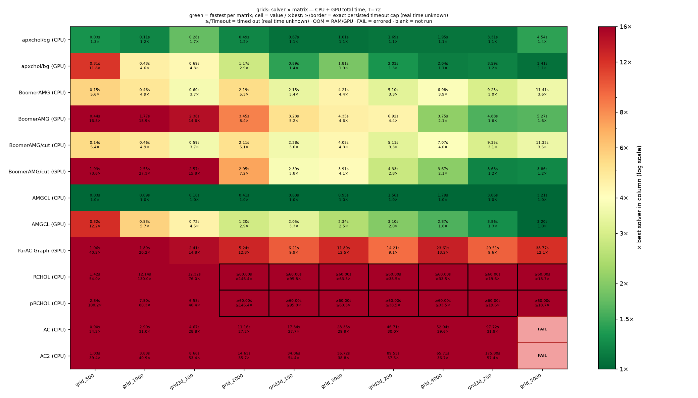
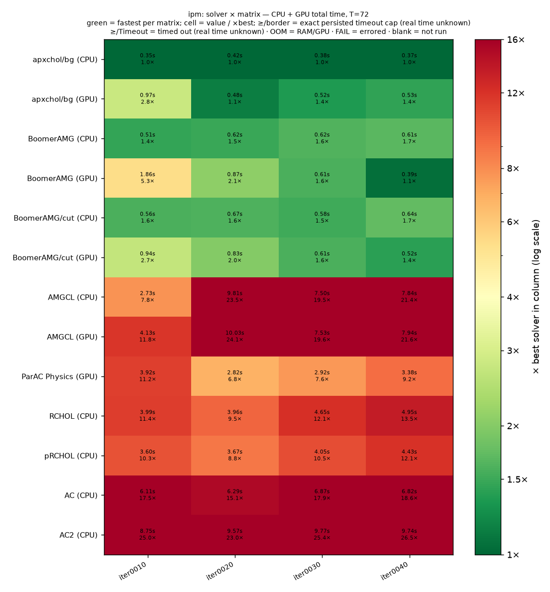
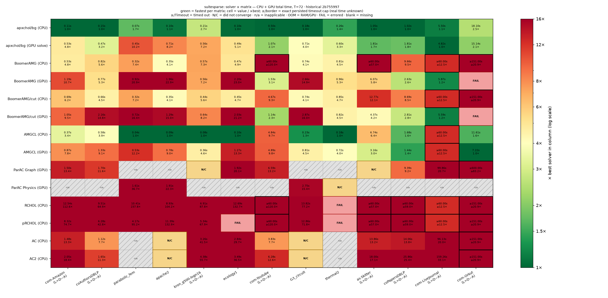
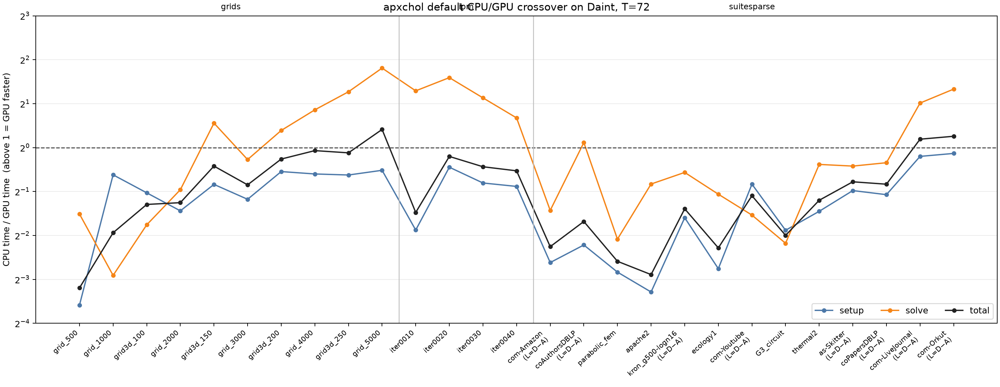
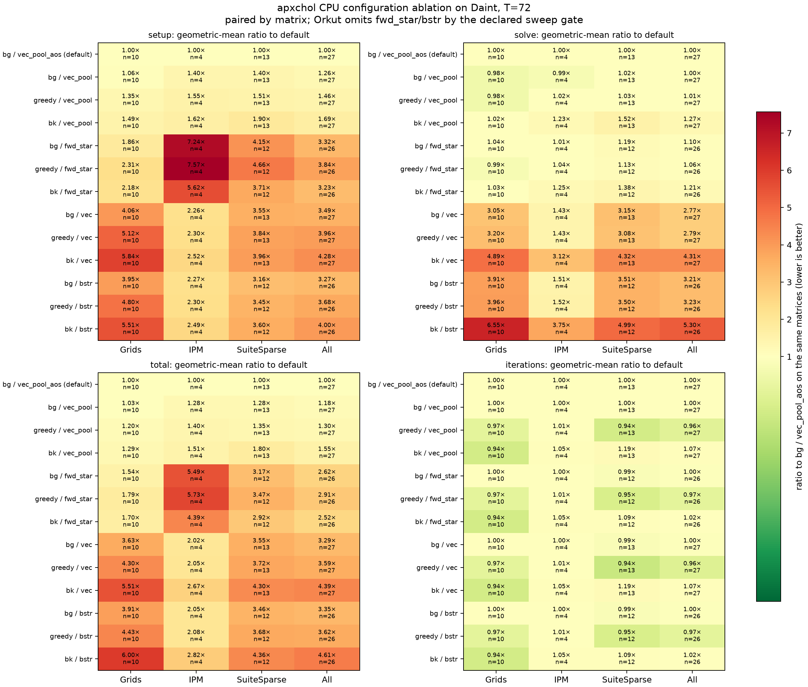

# Daint benchmarks

These results use one CSCS Daint GH200 node: a 72-core Grace CPU and its Hopper
GPU. They are kept separate from the x86/RTX laptop campaign because absolute
times are machine-specific.

## Fair T=72 solver comparison

The current campaign covers 27 matrices with three full setup-and-solve
repetitions per cell. Every completed result is graded by an independently
recomputed true relative residual at `1e-8`; timeouts and failures remain visible.

| grids | LP-IPM | SuiteSparse |
|---|---|---|
|  |  |  |

Each heatmap reports total time relative to the fastest completed method for
that matrix. Read the [compact numerical summary](fair_t72_summary.md) for the
exact denominator, convergence outcomes, paired geometric means, and coverage
boundary; [fair_t72.csv](fair_t72.csv) is the portable cell extract.

Two focused apxchol views separate device crossover from implementation choices:

| CPU/GPU crossover | CPU selector/storage ablation |
|---|---|
|  |  |

The ARM64 campaign uses explicitly labelled portable paths where an x86-only
dependency is avoidable: RCHOL/pRCHOL retain the upstream factorization and PCG
recurrence but replace MKL kernels; AC/AC2 run under the official ARM64 Julia
build; ParAC's CUDA drivers run natively. ParAC CPU still requires oneMKL, and
CMG is omitted because native Linux MATLAB is x86-64. These omissions are not
silently replaced by unlike timing baselines.

Regenerate the committed extract and figures from a downloaded cell store:

```bash
python3 benchmarks/daint/render_fair_t72.py --cells /path/to/results-final
```

## Setup-scaling archive

The earlier apxchol-only campaign contains 189 timing records at
T=1/2/4/8/16/36/72 plus 18 structural probes and a bracketed historical A/B.
Its [summary](summary.md), [scaling data](scaling.csv), and existing figures are
retained as the setup-scaling record; they are not mixed into the fair-solver
heatmaps above. Reproduce them with `render_campaign.py` as documented in the
script help.
