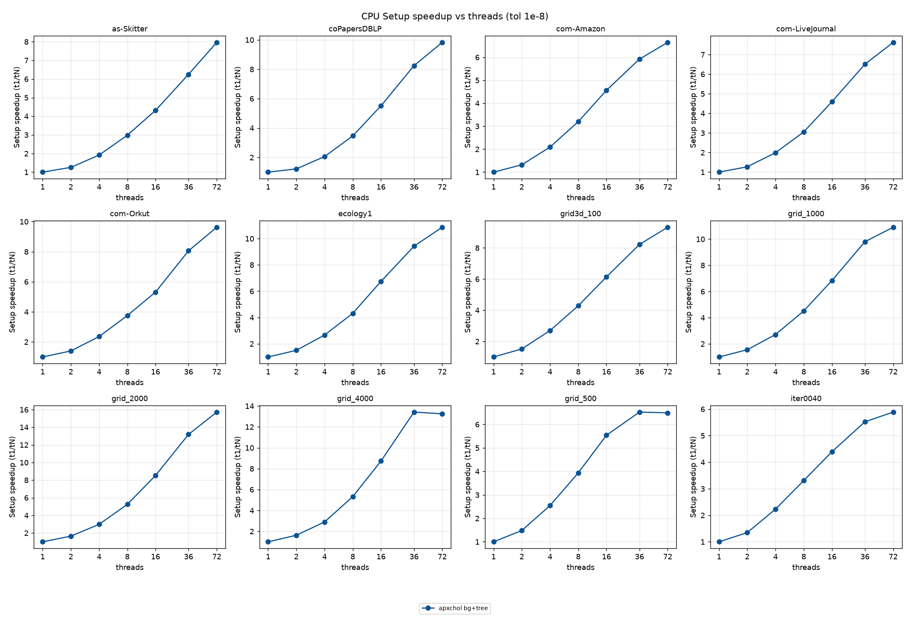
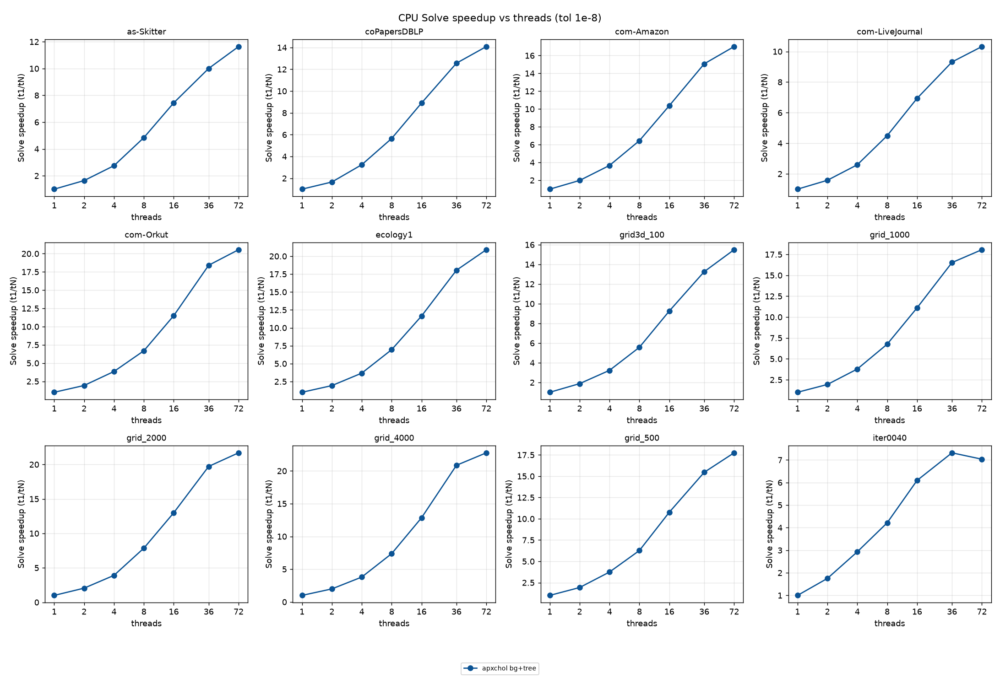
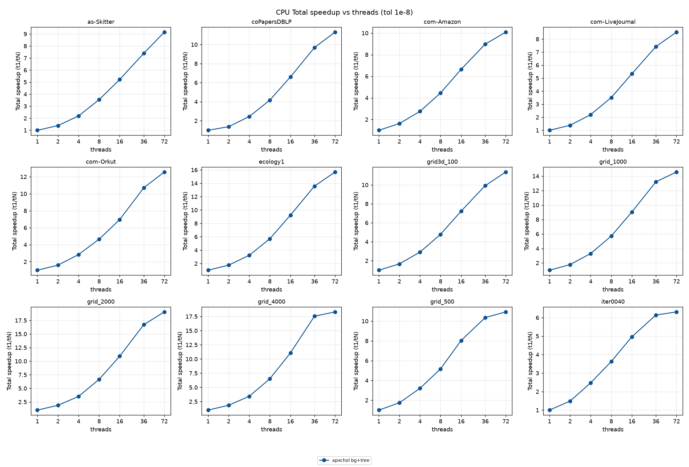

# Historical Daint CPU scaling — ea01e2ff

This is the preserved CPU scaling series previously displayed in the Daint index:84 converged cells,12 matrices and T=1,2,4,8,16,36,72, on source `ea01e2ff32b171d94ae8c048436df98203a0fc67`. Its CSV and three figures retain their original bytes. The [current Daint index](../../) separately identifies its CPU scaling source; this archive is not a new run.

[Recorded values](thread_scaling.csv)

## Setup scaling

## Converged-solve scaling

## Total scaling

Each curve uses that campaign's main T=1 timing as its denominator. Comparing this archive with a later campaign describes changes between snapshots; it is not an interleaved optimization A/B experiment. The older one-iteration189-record diagnostic is a different archive linked from [historical campaigns](../../HISTORICAL.md).
