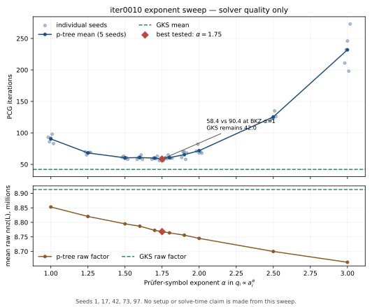
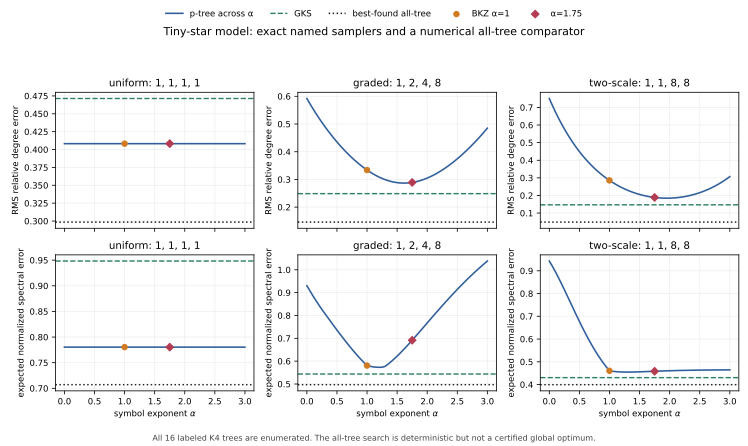

# BKZ26 weighted-Prüfer clique experiment

This branch contains an opt-in reference implementation of Algorithm 1 in
Yves Baumann, Rasmus Kyng, and Gernot Zöcklein, *VAC: A
Volume-sampling-based Elimination Rule for Approximate Cholesky
Factorization* (July 28, 2026; [PDF](https://rasmuskyng.com/papers/BKZ26.pdf)).
The comparison baseline is the current GKS tree sampler from Yuan Gao, Rasmus
Kyng, and Daniel Spielman, *AC(k): Robust Solution of Laplacian Equations by
Randomized Approximate Cholesky Factorization*
([SIAM J. Sci. Comput. 48(3), 2026](https://doi.org/10.1137/24M1673577)).

The result is negative for changing apxchol's default: over the valid broad
quality campaign, BKZ26 changed mean PCG iterations from `44.93` to `59.90`
and lost iterations in every seed on 6/8 matrices. Raw and stored factor sizes
were nearly unchanged. The implementation and experiment remain useful as a
faithful, connected, unbiased reference.

## Exact elimination and the two tree estimators

Suppose pivot `v` has active neighbors `i` with incident conductances `a_i`,
total `W=sum_i a_i`, and diagonal `D`. Exact Schur elimination removes `v` and
adds the dense clique

```text
c_ij = a_i a_j / D,       i != j.
```

For a pure Laplacian, `D=W`. Materializing every clique edge is quadratic in
the pivot degree, so apxchol emits an unbiased spanning tree instead.

**GKS.** Sort neighbors by nondecreasing `a_i`. Each source `i`, except the
last, chooses exactly one later (therefore no lighter) parent `j` with
probability `a_j/S_i`, where `S_i=sum_{k>i} a_k`, and emits weight

```text
h_i = a_i S_i / D.
```

Thus every source emits exactly the same mass `h_i` in every sample; only its
destination changes. That fixes the source's own contribution to its sampled
clique degree. A vertex can still receive random edges from earlier sources,
so this is not a claim that GKS makes every vertex's *total* degree
deterministic.

**BKZ26 / weighted Prüfer.** Draw a Prüfer code of length `d-2` with iid symbol
probabilities `q_i=a_i/W`. The decoded tree includes `{i,j}` with probability
`q_i+q_j=(a_i+a_j)/W`, so apxchol emits

```text
(W/D) a_i a_j / (a_i+a_j).
```

This makes every clique edge unbiased and the sampled clique connected, but it
has no fixed one-edge contribution per neighbor. The realized per-neighbor
degrees can therefore move together with the random Prüfer counts and selected
endpoints. Those sampled edges become the next residual graph: degree errors
change later neighborhoods, pivot priorities, sampled cliques, fill, and
ultimately the preconditioner seen by PCG. This is a mechanism, not a theorem
that one local metric orders global convergence.

For SDDM pivots, the implementation's `W/D` factor is the unbiased extension
of the paper's pure-Laplacian rule. The implementation is
[`volume_tree_elimination`](../../include/apxchol/solver/elimination/volume_tree.h)
and can be selected with `factor_options::clique_sampler="bkz26"`, CLI option
`--clique-sampler bkz26`, or `APXCHOL_CLIQUE_SAMPLER=bkz26` in the benchmark.
Only clique sampling changes; pivot selection, parallel rounds, residual
storage, factor assembly, and PCG remain apxchol's. This is not the full VAC
algorithm. GKS remains the default.

## Broad matrix evidence: BKZ26 versus GKS

The complete provenance and reproduction harness are under
[`daint-broad`](daint-broad/README.md). Daint job `4571740` used source commit
`6be1d2dda7ba70313e66f1a88da19804242b4dc3`, one exclusive node, a fixed
component-compatible RHS per matrix, and seeds `{1,17,42,73,97}`. It ran
`GKS-before / BKZ26 / GKS-after` for every seed.

The quality denominator is **8/8 matrices, 5/5 seeds, 120/120 arm records,
40/40 exact GKS brackets, and 120/120 converged true residuals**. “Raw” is the
assembled factor count; “stored” is the count after SpTRSV storage preparation.
Pair-level values are in
[`result-pairs.tsv`](daint-broad/result-pairs.tsv), with aggregates in
[`result-aggregate.tsv`](daint-broad/result-aggregate.tsv).

The timing columns are exploratory, not acceptance-quality measurements. The
four 72-core ranks advanced through different matrices without synchronizing
their measured phases. In a post-run audit of the 40 unchanged GKS
before/after pairs, symmetric drift exceeded 5% in 7 setup, 15 solve, and 5
total measurements; maximum solve drift was `1.624x`. Values below divide
BKZ26 by the geometric mean of its two surrounding GKS runs, which reduces
local drift but cannot remove changing cross-rank load. They are included to
show scale, not to rank close timings.

| matrix | mean iterations GKS → BKZ26 | raw nnz | stored nnz | setup† | solve† | one-RHS total† |
|---|---:|---:|---:|---:|---:|---:|
| iter0010 | 41.0 → 90.0 | 0.993x | 0.992x | 0.993x | 2.141x | 1.266x |
| iter0020 | 37.2 → 61.2 | 1.008x | 1.010x | 1.003x | 1.539x | 1.157x |
| iter0030 | 51.0 → 62.6 | 1.013x | 1.014x | 0.996x | 1.217x | 1.061x |
| iter0040 | 56.2 → 73.2 | 1.011x | 1.020x | 0.789x | 1.246x | **0.925x** |
| grid_500 | 47.2 → 48.6 | 1.006x | 1.006x | 1.007x | 1.007x | 1.006x |
| G3_circuit | 46.2 → 52.6 | 1.012x | 1.012x | 1.157x | 1.168x | 1.159x |
| thermal2 | 44.6 → 50.6 | 1.009x | 1.009x | 1.078x | 1.184x | 1.112x |
| com-Amazon | 36.0 → 40.4 | 1.044x | 1.044x | 1.174x | 1.207x | 1.183x |
| **all 40 pairs** | **44.93 → 59.90** | **1.012x** | **1.013x** | **1.018x** | **1.305x** | **1.104x** |

The quality loss is not IPM-only. All five seeds lost iterations on every IPM
iterate, `G3_circuit`, and `thermal2`; `grid_500` was nearly neutral, and
`com-Amazon` was mixed but worse on average. `iter0040` had a nominal total-time
win because its sampled setup happened to be much faster, but the timing
protocol is not strong enough to treat that as a matrix-level result.

`as-Skitter` is outside the denominator. Its historical RHS was only globally
zero-sum, while the retained component audit reports 756 components, so its
reported residuals and iterations were invalid. It was excluded rather than
counted as a sampler failure.

## Exponent sweep: quality only

An earlier experiment generalized the Prüfer symbol law to
`q_i proportional to a_i^alpha` and divided each selected exact edge by its
actual inclusion probability `q_i+q_j`. The five-seed `iter0010` summary was
recovered into [`alpha-sweep-recovered.tsv`](alpha-sweep-recovered.tsv) and
plotted by [`plot_alpha_sweep.py`](plot_alpha_sweep.py):



| sampler | iterations over seeds 1,17,42,73,97 | mean | mean raw nnz(L) |
|---|---:|---:|---:|
| GKS | 40, 42, 42, 44, 42 | **42.0** | 8.913M |
| BKZ26, `alpha=1` | 93, 86, 92, 98, 83 | 90.4 | 8.853M |
| best tested, `alpha=1.75` | 56, 60, 60, 56, 60 | **58.4** | 8.768M |
| `alpha=2` | 71, 82, 68, 70, 68 | 71.8 | 8.745M |

The surprise is real: emphasizing heavy neighbors near `alpha=1.75` was
substantially better than the mathematically natural BKZ value `alpha=1`, even
while producing a slightly smaller raw factor. It still needed 39% more
iterations than GKS on this matrix. The historical workstation was not
isolated, so the recovered sweep supports iteration and raw-fill comparisons
only—no setup, solve, or total-time claim.

The sweep source survives at git commit
`2c47ab64d8a0a9d90849e80121b0db0782268726`. The complete raw all-alpha TSV
does not; the committed table is recovered summary-level evidence. The
source report also records nonconvergence at `alpha=0`, but the exact five raw
records for `alpha=0` and `0.5` were not recoverable, so they are not plotted.

## Local model: degree variance and spectral error

The seed-42 full-factorization diagnostic compared each encountered neighbor's
sampled degree with `t_i=a_i(W-a_i)/D`. It observed relative L1/L2 values
`0.0836/0.1031` for GKS and `0.1299/0.2204` for BKZ26. This is a trajectory
diagnostic: the samplers encounter different later stars, so it is not an
identically distributed local experiment.

Two exact small-star checks isolate the sampler. [`small_star_error.py`](small_star_error.py)
enumerates all outcomes for six-neighbor stars and independently checks the
second moments:

| six-neighbor weights | GKS RMS degree error | BKZ | `alpha=1.75` |
|---|---:|---:|---:|
| all 1 | .5164 | **.4472** | .4472 |
| 1, 2, 4, 8, 16, 32 | **.2411** | .3501 | .2883 |
| 1, 1, 1, 1, 100, 100 | **.0195** | .1360 | .0333 |

[`tiny_star_spectral.py`](tiny_star_spectral.py) reconstructs the preserved
four-neighbor analysis. It enumerates all 16 labeled trees exactly for GKS and
every p-tree point. The upper row below is normalized degree RMS; the lower row
is `E ||C^{+1/2}(C_hat-C)C^{+1/2}||_2`. The dotted line is an
objective-specific, deterministic multistart search over all tree
distributions; it is a numerical lower comparator, **not a certified global
optimum**.



The model has no universal winner. BKZ beats GKS on the uniform star; GKS has
lower degree and spectral error on the two skewed stars. Moving toward
`alpha=1.75` improves degree error there, but can worsen spectral error. The
all-tree comparator shows that neither named family is generally optimal.
These four- and six-neighbor models explain plausible variance mechanisms;
they do not turn a local norm into a global PCG prediction. The definitions and
closed forms are in [`local-degree-moments.md`](local-degree-moments.md), and
the generated values are in [`tiny-star-spectral.tsv`](tiny-star-spectral.tsv).

## Reproduction and decision

From this directory, regenerate every local table/chart with:

```bash
python3 small_star_error.py > small-star-error.tsv
python3 tiny_star_spectral.py \
  --tsv tiny-star-spectral.tsv --plot tiny-star-spectral.svg
python3 plot_alpha_sweep.py \
  --input alpha-sweep-recovered.tsv --output alpha-sweep-iter0010.svg
```

The committed artifacts were validated with NumPy 2.5.2, SciPy 1.18.1, and
Matplotlib 3.11.1.

The broad campaign has separate [Daint instructions](daint-broad/README.md).

Do not replace GKS with this BKZ26 sampler. The failure is broader than one IPM
matrix and is dominated by solve quality, not by the reference sampler's
binary-search overhead. What remains useful is:

- a compact, connected, unbiased BKZ26 Algorithm 1 implementation for direct
  comparison and future VAC integration;
- reproducible broad and tiny-model harnesses that separate timing, global
  quality, and local estimator questions;
- a clear implementation optimization: one alias table would realize the
  paper's linear sequential sampling work instead of the current `d-2` binary
  searches. It may improve setup, but cannot change this distribution's PCG
  iterations.

Limitations: the broad quality result is one CPU node, one RHS per matrix,
eight matrices, and five factor seeds; its unsynchronized four-rank layout
makes timing exploratory. The exponent result is summary-level evidence on
`iter0010`, not a broad timing campaign. The tiny-star optimizer is numerical
rather than certified. The original 2026-09-02 analysis scripts and text
outputs survived, but no original image did; the committed spectral chart is a
reproducible scoped reconstruction.
