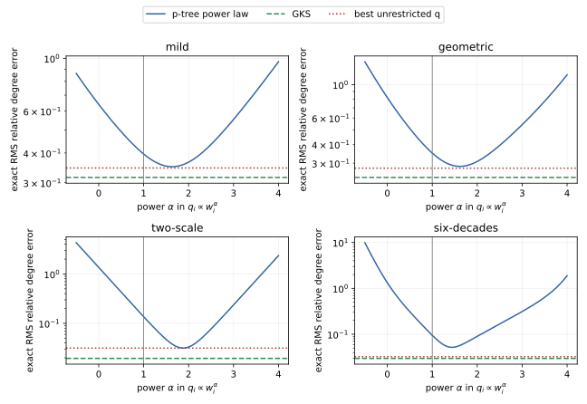

# Local degree-error formulas

This note analyzes one fixed pivot star. It explains the diagnostic used in
the branch README; it does not claim that local degree error alone determines
global PCG convergence.

Let neighbor weights be `w_i`, `W=sum_i w_i`, and `D` the pivot diagonal. The
exact Schur-clique degree received by neighbor `i` is

```text
t_i = w_i (W-w_i) / D.
```

## GKS

Order the weights increasingly. For source `r`, let
`S_r=sum_{j>r} w_j`. GKS independently chooses one `J_r>r` with probability
`w_j/S_r` and emits an edge of weight `h_r=w_r S_r/D`. Therefore

```text
Var(t_hat_i) = sum_{r<i} h_r^2 (w_i/S_r) (1-w_i/S_r).
```

Writing `Q_r=sum_{j>r} w_j^2`, the total degree mean-square error is

```text
sum_i Var(t_hat_i) = (1/D^2) sum_r w_r^2 (S_r^2-Q_r).
```

This total is computable in linear work after sorting. The increasing order is
optimal within this independent parent-to-suffix family: swapping adjacent
weights `x,y` before a suffix of total weight `S` changes the objective by

```text
V(x,y)-V(y,x) = 2 x y S (x-y) / D^2.
```

Thus putting `x<=y` first never increases the error.

## Prüfer p-trees

Let `q_i>0`, `sum_i q_i=1`, and draw the iid Prüfer symbols from `q`. Then

```text
P({i,j} in T) = p_ij = q_i+q_j,
h_ij = (w_i w_j / D) / p_ij.
```

For distinct edges sharing vertex `i`, the product-clique spanning-tree law is
determinantal and

```text
Cov(I_ij,I_ik) = -q_j q_k.
```

Consequently,

```text
Var(t_hat_i)
  = sum_{j!=i} h_ij^2 p_ij(1-p_ij)
    - 2 sum_{j<k; j,k!=i} h_ij h_ik q_j q_k.
```

The exact RMS relative degree error compared in this experiment is

```text
sqrt(sum_i Var(t_hat_i) / sum_i t_i^2).
```

BKZ26 is the particular choice `q_i=w_i/W`. Other choices remain unbiased when
the emitted edge is divided by `q_i+q_j`, but small pair marginals create large
Horvitz-Thompson weights. The largest possible multiplier in one star is
`1/min_{i<j}(q_i+q_j)`.

## Numerical optimization

[`ptree_q_optimization.py`](ptree_q_optimization.py) evaluates the formulas,
optimizes a power law `q_i proportional to w_i^alpha`, and separately optimizes
all coordinates of `q` on the simplex. Multiple starts are used because the
unrestricted problem is not assumed convex.

| weights | GKS | BKZ `alpha=1` | best power (`alpha`; error) | best unrestricted `q` (error; max multiplier) |
|---|---:|---:|---:|---:|
| all 1 | .51640 | **.44721** | any; .44721 | .44721; 3 |
| 1, 1.5, 2, 3, 5, 8 | **.31586** | .39602 | 1.632; .35037 | .34606; 27.9 |
| 1, 2, 4, 8, 16, 32 | **.24109** | .35009 | 1.616; .28551 | .27776; 213 |
| 1, 1, 1, 1, 100, 100 | **.01951** | .13600 | 1.879; .03150 | .03150; 5,720 |
| six decades | **.02985** | .09479 | 1.436; .05194 | .03251; 98.6 million |

The result is not a universal impossibility theorem. It does show that on these
skewed stars, optimizing `q` cannot match GKS's expected degree error, and the
unrestricted optimum often buys its improvement with extreme rare-edge
weights. A practical follow-up should therefore compare a connectivity-safe
per-star choice between GKS and a protected p-tree, rather than optimizing
unconstrained `q` alone.



## Why a skewed star separates the samplers

Take four light neighbors of weight `epsilon` and two heavy neighbors of
weight one. As `epsilon` tends to zero, the exact relative degree RMS errors
have leading orders

```text
GKS                 = 2 epsilon + O(epsilon^2)
BKZ q proportional w = sqrt(2 epsilon) + O(epsilon)
```

More generally, with `m` equal light neighbors the leading terms are
`sqrt(m) epsilon` and `sqrt(m epsilon / 2)`. The BKZ heavy-heavy edge has
inclusion probability `2/(2+m epsilon)`: it is omitted with probability about
`m epsilon/2`, but its conductance is order one. Those rare omissions therefore
contribute order `epsilon` variance. GKS always includes the edge between the
two heaviest neighbors, and its remaining errors are only order `epsilon` in
amplitude, hence order `epsilon^2` in variance. Exact enumeration gives the
ratio below:

| epsilon | GKS | BKZ | BKZ / GKS |
|---:|---:|---:|---:|
| 1e-2 | .01951 | .13600 | 6.97 |
| 1e-4 | .00019995 | .014136 | 70.70 |
| 1e-6 | .000002000 | .0014142 | 707.11 |

This explains why weight skew can strongly favor GKS locally. It does not by
itself prove that an IPM factor must have fewer PCG iterations: errors interact
across many changing pivot stars.

## A connected unbiased repair of the rare-omission mechanism

One can make a deterministic matching edge exact without increasing the
`d-1`-edge budget. For a matched pair `{a,b}`:

1. emit its exact clique edge `w_a w_b / D`;
2. contract the pair to a component of weight `w_a+w_b`;
3. draw a product-clique p-tree on the components;
4. expand a component edge `C-D` by choosing endpoints proportionally to their
   original weights and emit
   `W W_C W_D / (D (W_C+W_D))`.

The result is a tree: one matching edge plus a tree on the contracted graph.
For an unmatched pair `i in C`, `j in D`, its inclusion probability is

```text
((W_C+W_D)/W) * (w_i/W_C) * (w_j/W_D),
```

so the emitted weight above has expectation `w_i w_j/D`; the matching edge is
already exact. [`matched_ptree_error.py`](matched_ptree_error.py) enumerates all
outcomes and verifies every expected vertex degree.

Conditioning only the two heaviest vertices nearly removes BKZ's extreme-skew
gap, but is not a general replacement:

| weights | GKS | BKZ | alpha=1.75 | exact top-heavy pair |
|---|---:|---:|---:|---:|
| all 1 | .51640 | **.44721** | .44721 | .51208 |
| 1, 1.5, 2, 3, 5, 8 | **.31586** | .39602 | .35200 | .36058 |
| 1, 2, 4, 8, 16, 32 | **.24109** | .35009 | .28834 | .27225 |
| 1, 1, 1, 1, 100, 100 | **.01951** | .13600 | .03327 | .01965 |
| six decades | **.02985** | .09479 | .06601 | .03002 |

Thus the rare-heavy-edge diagnosis is mathematically repairable, but GKS still
wins these nonuniform examples. A production candidate should choose between
connected unbiased laws from the observed star weights, rather than replace
GKS globally.
